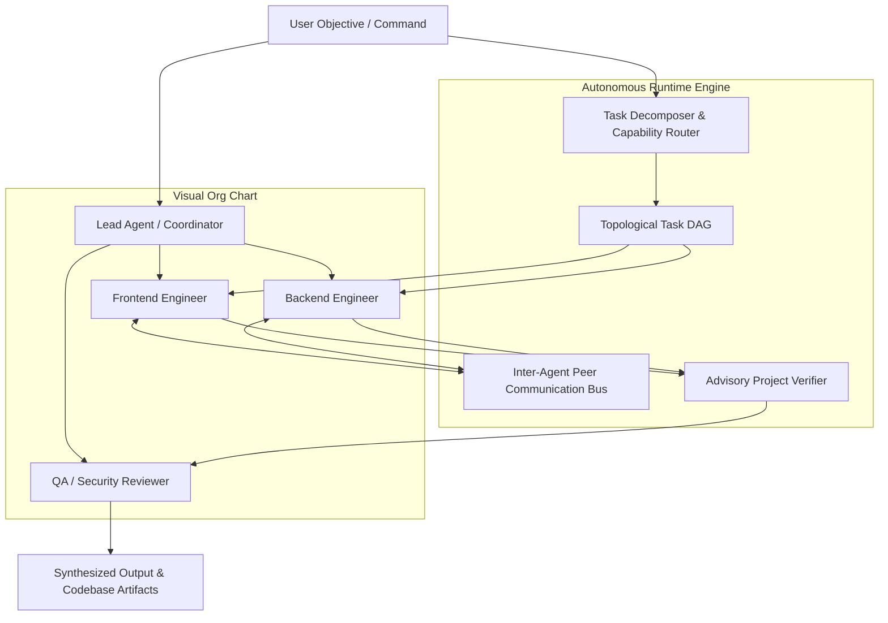
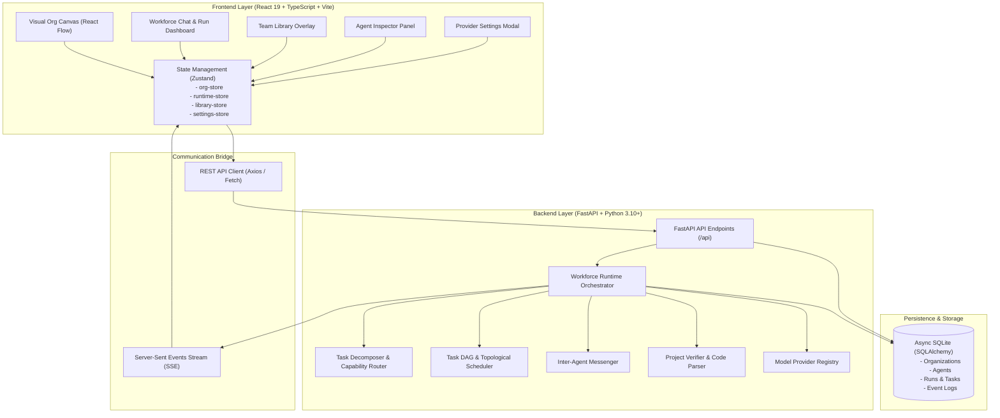
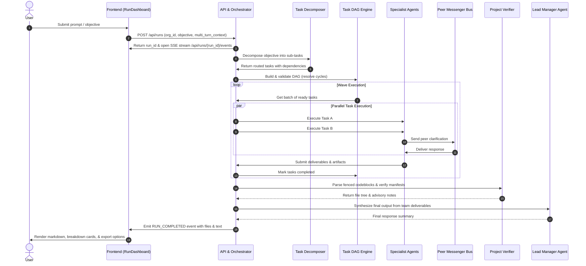

# Ekans - Visual AI Workforce Operating System

Ekans is a local-first, visual operating system for building, managing, and orchestrating multi-agent AI teams. It allows users to structure specialized AI agents into hierarchical organizational charts, assign high-level project objectives, and supervise autonomous task decomposition, parallel execution, peer-to-peer agent collaboration, and codebase generation in real time.

---

## Table of Contents

- [System Overview](#system-overview)
- [Core Capabilities](#core-capabilities)
- [System Architecture](#system-architecture)
- [Runtime Execution Lifecycle](#runtime-execution-lifecycle)
- [Key Features](#key-features)
  - [Visual Organization Canvas](#visual-organization-canvas)
  - [Multi-Turn Infinite Workforce Chat](#multi-turn-infinite-workforce-chat)
  - [Agent Task Distribution Breakdown](#agent-task-distribution-breakdown)
  - [Team Library and Persistence](#team-library-and-persistence)
  - [Codebase Generation and Export](#codebase-generation-and-export)
  - [Multi-Provider LLM Engine](#multi-provider-llm-engine)
- [Project Directory Structure](#project-directory-structure)
- [Installation and Setup](#installation-and-setup)
  - [Prerequisites](#prerequisites)
  - [Backend Setup](#backend-setup)
  - [Frontend Setup](#frontend-setup)
- [Configuration and API Keys](#configuration-and-api-keys)
- [API Reference](#api-reference)
- [Technical Stack](#technical-stack)

---

## System Overview

Traditional multi-agent frameworks often function as rigid sequential pipelines or opaque script executions that are difficult to visualize, configure, or debug.

Ekans separates the **Organizational Structure** (who reports to whom and what capabilities each agent possesses) from the **Runtime Task DAG** (what tasks are created and in what order they execute).



---

## Core Capabilities

- **Visual Org Chart Design**: Drag-and-drop hierarchy builder powered by React Flow with automatic Dagre tree layout, custom node styling, connection handles, and role badges.
- **Dynamic Task Decomposition**: LLM coordinators analyze natural language prompts and break them down into minimal, non-redundant specialist sub-tasks.
- **Capability-Based Task Routing**: Weighted capability matching automatically assigns tasks to the best-suited agent based on roles, tools, and declared responsibilities.
- **Parallel DAG Execution**: Topological sorting executes independent tasks concurrently while respecting strict dependency prerequisites.
- **In-Flight Peer Communication**: Agents communicate directly via a dedicated messaging bus during runtime to ask clarification questions, share context, and exchange data.
- **Advisory Code Verification**: Automated parser verifies file structures, entrypoints, package manifests, and multi-file syntax without hard-failing executions.
- **Infinite Multi-Turn Conversations**: Continuous conversational interface that maintains conversation history, context, and accumulated codebase files across follow-up turns.
- **Local Code Sync & ZIP Export**: Generated projects can be downloaded as `.zip` archives or written directly into a selected local directory on disk.
- **Local-First & Multi-Provider**: Runs locally with SQLite persistence; supports Google Gemini, OpenAI, OpenRouter, Anthropic Claude, and Ollama.

---

## System Architecture



---

## Runtime Execution Lifecycle



---

## Key Features

### Visual Organization Canvas
- Interactive workspace for assembling teams of AI agents.
- Drag-and-drop connections to define reporting lines.
- One-click automatic tree layout calculated using Dagre.
- Node inspection panel to configure roles, system prompts, available tools, permissions, and custom LLM providers.

### Multi-Turn Infinite Workforce Chat
- Continuous conversational workflow enabling iterative prompting, debugging, and project refinements.
- Automatically preserves multi-turn conversation context and file deliverables across turns.
- Pinned bottom prompt input with auto-growing textarea and keyboard shortcuts (`Enter` to send, `Shift+Enter` for newlines).

### Agent Task Distribution Breakdown
- Real-time breakdown list inspired by modern developer tooling.
- Displays every delegated specialist with:
  - Role title and assigned sub-team (e.g., `Revenue team`, `Delivery team`, `Testing team`).
  - Status dot indicator and uppercase status badge (`COMPLETED`, `RUNNING`, `FAILED`, `PENDING`).
  - Token consumption and elapsed duration metrics.
  - Expandable panels revealing sub-task instructions, deliverable text, and live logs.

### Team Library and Persistence
- Full-page library overlay for managing saved organizational setups.
- Real-time graphical preview cards rendering visual hierarchy graphs.
- Actions for saving new teams, updating existing teams, cloning, renaming, and switching active teams.

### Codebase Generation and Export
- Automatic extraction of multi-file project structures from agent outputs.
- One-click ZIP download generating standard archives in memory.
- Direct filesystem synchronization using the browser File System Access API.

### Multi-Provider LLM Engine
- Unified provider registry supporting:
  - **Google Gemini** (Gemini 2.0 Flash, Gemini 1.5 Pro, Flash Lite)
  - **OpenAI** (GPT-4o, GPT-4o-mini, o3-mini)
  - **OpenRouter** (Unified access to Claude 3.5 Sonnet, DeepSeek R1, Llama 3.3)
  - **Anthropic** (Claude 3.5 Sonnet, Claude 3 Opus)
  - **Ollama / Local Endpoints** (Local models via standard OpenAI-compatible API)

---

## Project Directory Structure

```
Ekans/
├── app/
│   └── frontend/                     # React 19 + Vite Frontend Application
│       ├── public/                   # Static assets
│       ├── src/
│       │   ├── assets/               # Icons and UI images
│       │   ├── components/
│       │   │   ├── canvas/           # OrgCanvas, AgentNode, OrgEdge, TeamGraphPreview
│       │   │   ├── common/           # Toolbar, SearchBar, ContextMenu, Toast
│       │   │   ├── dialogs/          # TeamLibrary, SaveTeamDialog, SettingsDialog
│       │   │   ├── inspector/        # InspectorPanel (Agent configuration)
│       │   │   └── runtime/          # RunDashboard (Workforce Chat, Agent Cards)
│       │   ├── memory/               # Obsidian vault memory integration
│       │   ├── services/             # API client, ZIP service, FileSystem service
│       │   ├── store/                # Zustand stores (org, runtime, library, settings)
│       │   ├── types/                # TypeScript interface definitions
│       │   ├── App.tsx               # Primary application shell
│       │   ├── index.css             # Unified dark design system styles
│       │   └── main.tsx              # Application entrypoint
│       ├── package.json              # Frontend package manifest
│       └── vite.config.ts            # Vite configuration
│
├── backend/                          # FastAPI Backend Application
│   ├── api/
│   │   └── routes.py                 # REST endpoints and SSE event streaming
│   ├── events/
│   │   └── event_bus.py              # Asynchronous in-memory event publisher
│   ├── models/
│   │   └── domain.py                 # Pydantic models and database schema definitions
│   ├── providers/
│   │   ├── base.py                   # ModelProvider abstract interface
│   │   ├── google_provider.py        # Native Google Gemini provider implementation
│   │   └── registry.py               # Multi-provider registry & dispatch engine
│   ├── runtime/
│   │   ├── context_router.py         # Context pruning and token window manager
│   │   ├── dag.py                    # Task DAG dependency engine & cycle resolver
│   │   ├── decomposer.py             # Capability router & task decomposer
│   │   ├── messenger.py              # In-flight peer messaging system
│   │   ├── orchestrator.py           # Central execution workflow coordinator
│   │   ├── project_verifier.py       # Codeblock parser, manifest & syntax verifier
│   │   └── sandbox.py                # Isolated execution environment
│   ├── storage/
│   │   └── database.py               # SQLAlchemy async SQLite database engine
│   ├── config.py                     # Environment and application configuration
│   ├── main.py                       # FastAPI application factory
│   └── requirements.txt              # Python dependencies
│
├── docs/                             # Technical design and architecture documents
├── .gitignore                        # Git exclusion rules
└── README.md                         # Project documentation
```

---

## Installation and Setup

### Prerequisites

- **Node.js**: v18.0.0 or higher
- **Python**: v3.10 or higher
- **Git**: Installed and configured

---

### Backend Setup

1. Open a terminal and navigate to the backend directory:
   ```bash
   cd Ekans/backend
   ```

2. Create and activate a Python virtual environment:
   - **Windows (PowerShell)**:
     ```powershell
     python -m venv venv
     .\venv\Scripts\Activate.ps1
     ```
   - **macOS / Linux**:
     ```bash
     python3 -m venv venv
     source venv/bin/activate
     ```

3. Install required Python packages:
   ```bash
   pip install -r requirements.txt
   ```

4. Start the FastAPI backend server:
   ```bash
   python -m uvicorn main:app --host 127.0.0.1 --port 8001 --reload
   ```
   The backend API will be available at `http://127.0.0.1:8001`.
   Interactive Swagger documentation is accessible at `http://127.0.0.1:8001/docs`.

---

### Frontend Setup

1. Open a second terminal and navigate to the frontend directory:
   ```bash
   cd Ekans/app/frontend
   ```

2. Install JavaScript dependencies:
   ```bash
   npm install
   ```

3. Start the Vite development server:
   ```bash
   npm run dev -- --port 5175
   ```
   The application interface will be available at `http://localhost:5175`.

---

## Configuration and API Keys

Ekans can be used with any supported AI model provider. API keys can be configured directly inside the application interface or via environment variables.

### In-App Configuration
1. Click the **Settings** button in the top navigation bar.
2. Select your preferred provider (e.g., Google Gemini, OpenAI, OpenRouter, Anthropic, or Ollama).
3. Enter your API key and choose the default model.
4. Click **Save Settings**.

### Environment Variables
Optionally, you can create a `.env` file inside `Ekans/backend/`:

```ini
# Server Configuration
HOST=127.0.0.1
PORT=8001
CORS_ORIGINS=["http://localhost:5175","http://127.0.0.1:5175"]

# Optional Default API Keys
GEMINI_API_KEY=your_gemini_api_key_here
OPENAI_API_KEY=your_openai_api_key_here
OPENROUTER_API_KEY=your_openrouter_api_key_here
ANTHROPIC_API_KEY=your_anthropic_api_key_here
OLLAMA_BASE_URL=http://localhost:11434/v1
```

---

## API Reference

| Method | Endpoint | Description |
|---|---|---|
| `GET` | `/api/health` | Service health check and uptime status |
| `GET` | `/api/organizations` | List all saved organizations and agent charts |
| `POST` | `/api/organizations` | Create or update an organization structure |
| `GET` | `/api/organizations/{id}` | Retrieve organization details and agent definitions |
| `DELETE` | `/api/organizations/{id}` | Delete an organization |
| `POST` | `/api/runs` | Trigger a new workforce execution run |
| `GET` | `/api/runs/{id}` | Get current run status, task outputs, and deliverables |
| `POST` | `/api/runs/{id}/cancel` | Cancel an active execution run |
| `GET` | `/api/runs/{id}/events` | Server-Sent Events (SSE) live event stream |
| `GET` | `/api/models/providers` | List available LLM providers and models |
| `POST` | `/api/models/validate` | Validate an API key against a provider |

---

## Technical Stack

### Frontend
- **Framework**: React 19 (TypeScript)
- **Build Tool**: Vite
- **Graph Visualization**: `@xyflow/react` (React Flow)
- **Graph Layout**: `dagre`
- **State Management**: Zustand
- **Styling**: Vanilla CSS (Tailored dark theme design tokens)
- **Archive Generation**: `jszip`

### Backend
- **Framework**: FastAPI (ASGI)
- **Server**: Uvicorn
- **Data Validation**: Pydantic v2
- **Database**: SQLite via SQLAlchemy (async with `aiosqlite`)
- **HTTP Client**: `httpx`
- **Provider SDKs**: Google GenAI / OpenAI Python SDK
